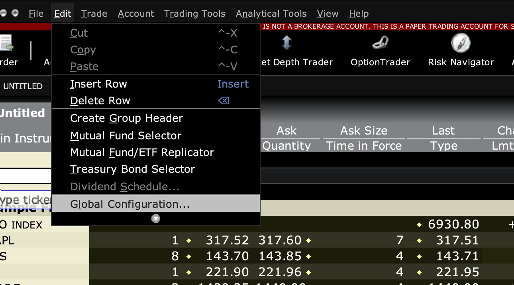
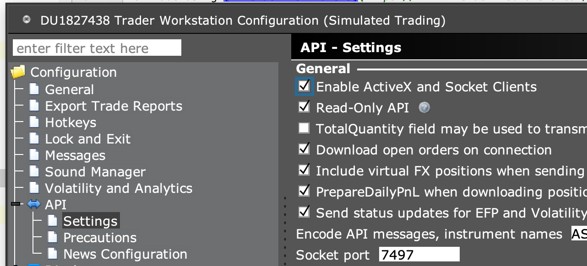

# SETUP

To trade using [Interactive Brokers](https://www.interactivebrokers.com/), the following steps are required:

1. Open an account or start a free trial

2. Download and install their *Trader Workstation* software (TWS).

3. Download the latest *IB API* zip file from http://interactivebrokers.github.io 
(currently `twsapi_macunix.979.01.zip` for MacOS and Linux, and `TWS API Install 979.01.msi` for Windows)

   1. Unzip or install this file somewhere in your computer.
   
   2. Add the `TwsApi.jar` to your classpath. By default, the [pom.xml](./pom.xml) of this sub-project points 
   to `${user.home}/dev/IBJts/source/JavaClient/TwsApi.jar`. Update the path accordingly.

4. Start the *Trader Workstation* program installed in step (2) and login with your account.

   1. Click on menu **Edit** then select **Global Configuration...** 
   
   2. Navigate to **Configuration/API/Settings**, then tick the option **Enable ActiveX and Socket Clients** 

   3. Take note of the **Socket Port** number, which defaults to `7497`

5. Finally, you should be able to start live trading through our framework using `InteractiveBrokers.trader()` 
and run simulations with `InteractiveBrokers.simulator()`, as usual.

> **NOTE** Work in progress, this is just a skeleton project for now.